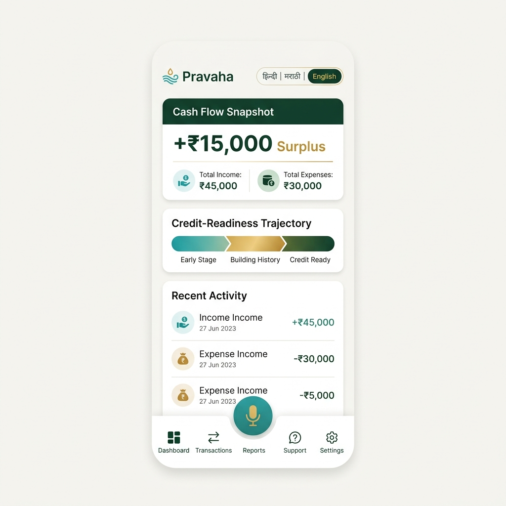
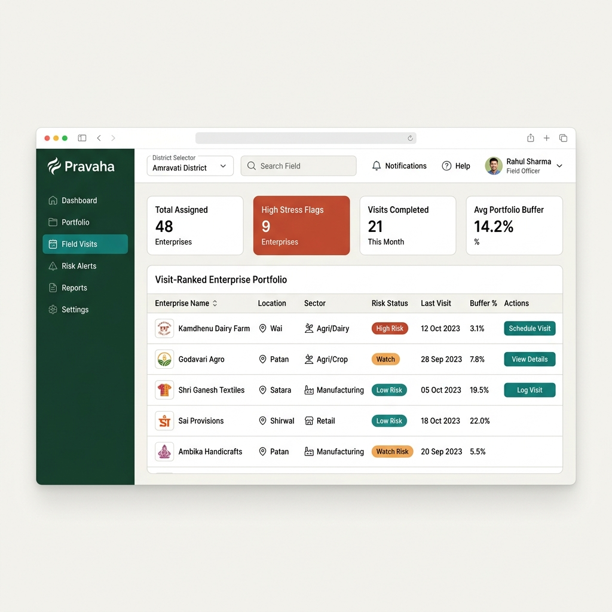
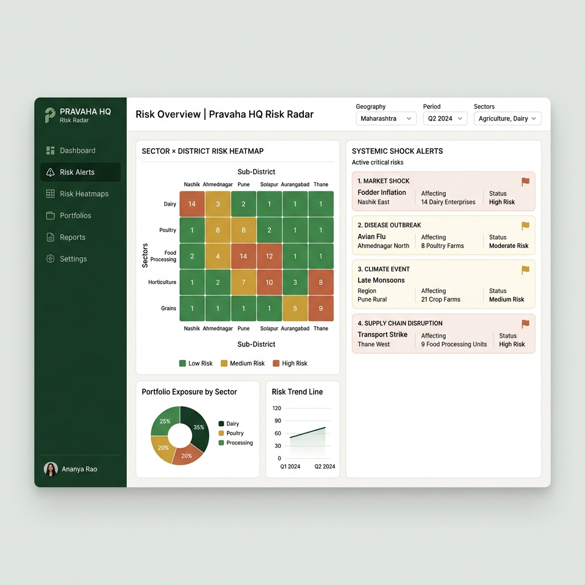
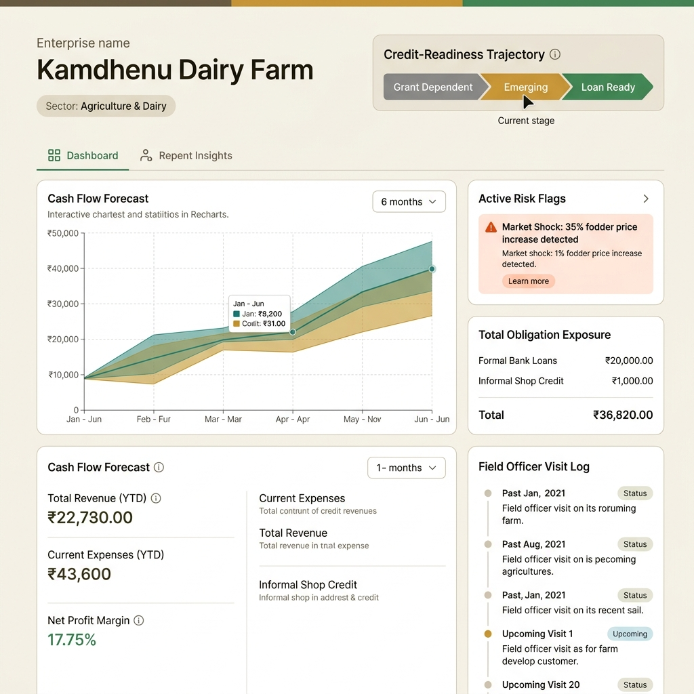
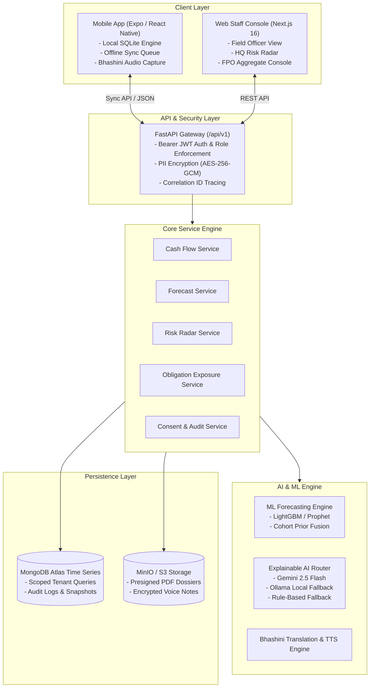
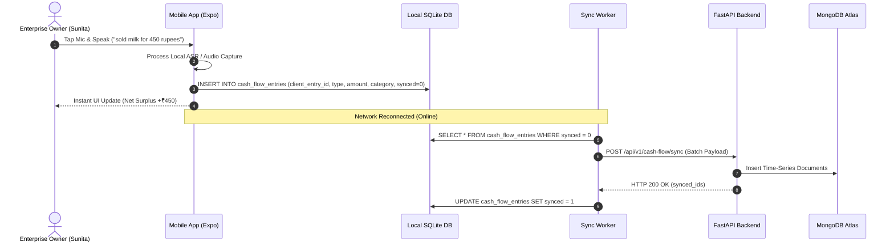
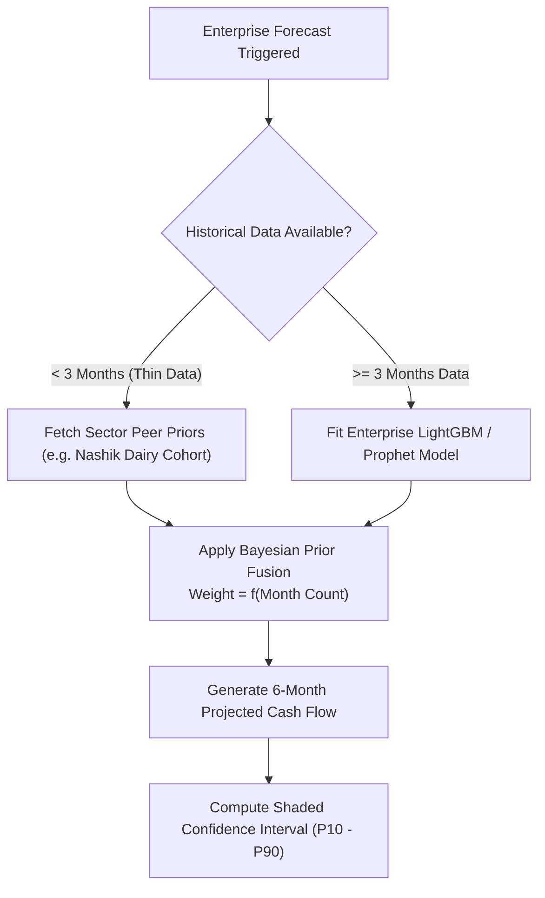
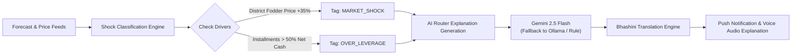

# Pravaha (प्रवाह) — AI-Driven Cash Flow Prediction & Risk Radar for Rural Micro-Enterprises

> **NABARD Hackathon Submission @ Global Fintech Fest 2026**
> 
> *Pravaha* ("Flow") is an end-to-end, AI-powered financial intelligence, total obligation exposure, and explainable risk-flagging platform designed specifically for rural micro-enterprises, Self-Help Groups (SHGs), and Farmer Producer Organizations (FPOs) across India.

---

## 📸 System Showcase & UI Gallery

### 1. Enterprise Mobile App — Local-First Voice & Cash Flow Snapshot

*Caption: **Pravaha Mobile App** — Offline-first cash flow tracker with single-tap Indian language voice entry (Bhashini ASR), 3-stage Credit-Readiness Trajectory indicator, and net surplus/deficit visualizer.*

> **Real-World Scenario:** Sunita Patil, owner of *Kamdhenu Dairy Farm* in Nashik, records a daily milk sale of ₹450 by speaking into the app in Marathi (*"आज ४५० रुपयांचे दूध विकले"*). The entry is parsed offline via local ASR, saved to Expo SQLite, and automatically synced to the cloud upon reaching cellular connectivity.

---

### 2. Field Officer Console — Visit-Ranked Portfolio Radar

*Caption: **Field Officer Portfolio Console** — Dynamically ranks micro-enterprise visits using Pravaha's Risk Impact Algorithm (Risk Severity × Days Unvisited × Cash Buffer Trend).*

> **Real-World Scenario:** Field Officer Rajesh Patil opens his morning console. *Kamdhenu Dairy Farm* is ranked #1 for urgent visit because an automated Market Shock flag was triggered and 18 days have elapsed since the last field check-in.

---

### 3. HQ Risk Radar — Macro Surveillance & Systemic Shock Clusters

*Caption: **HQ Risk Radar** — Sector × District risk heatmap and automated systemic shock cluster detection.*

> **Real-World Scenario:** NABARD / Bank HQ risk analysts monitor 142 micro-enterprises across 3 sub-districts. Pravaha automatically clusters 14 individual dairy enterprises in *Nashik East* sharing an identical 35% fodder price inflation shock, escalating it to a **Systemic Cluster Alert** before widespread loan defaults occur.

---

### 4. Enterprise Financial Profile & Bank Dossier

*Caption: **Enterprise Profile & Credit Assessment View** — 6-month interactive cash flow forecast area chart with shaded confidence bands, SHAP driver decomposition, total obligation audit, and officer visit timeline.*

> **Real-World Scenario:** When evaluating *Kamdhenu Dairy Farm* for a KCC top-up loan, the field officer views the enterprise dossier. The 6-month forecast shows a projected cash dip in July due to feed inflation, but overall 3-month non-flagged stability qualifies the farm for the **Emerging Credit Readiness** stage.

---

## 🏛️ Comprehensive System Architecture

Pravaha is engineered as a production-grade monorepo adhering to strict separation of concerns, multi-tier security, and local-first resilience.

### High-Level Architecture Diagram



### Architectural Invariants & Guarantees

1. **Strict Service Layer Boundaries**:
   - `api/` routes contain **zero business logic** — they only validate HTTP requests and route to `services/`.
   - `services/` contain pure business logic and DB calls, never importing HTTP frameworks.
   - `ml/` contains pure Python mathematical and machine learning models with **zero DB or network imports**.
2. **Local-First Resiliency**:
   - Mobile writes are committed to Expo SQLite immediately. The UI never blocks on network connectivity. Background sync pushes batched entries when online.
3. **Resilient AI Router Fallback Chain**:
   - Explanation generation executes through a 3-tier fallback: `Gemini 2.5 Flash` → `Ollama Local Model` → `Deterministic Rule Engine`. Network errors or API rate limits never bubble past `ai_router.py`.
4. **Tenant Scoping & Security**:
   - Every database query is scoped by `tenant_id` and user role (`field_officer`, `hq_risk_officer`, `fpo_officebearer`).
   - Sensitive PII fields (phone numbers, full names) are encrypted at the application level using AES-256-GCM.

---

## 🔄 Detailed System Workflows & Real-World Examples

### Workflow 1: Offline Voice Entry & Micro-Enterprise Cash Flow Logging



* **Step 1:** Sunita speaks in Marathi into the mobile app while offline in her village.
* **Step 2:** The app records the audio and parses the structured transaction (`income`, `₹450`, `milk_sale`).
* **Step 3:** The transaction is assigned a UUID `client_entry_id` and committed locally to SQLite within 15ms.
* **Step 4:** Upon traveling to a town with network coverage, the background sync worker detects connectivity, POSTs the queue to `/api/v1/cash-flow/sync`, and marks local records as synced.

---

### Workflow 2: Hybrid Forecasting & Cohort Prior Fusion



* **Scenario:** A newly onboarded poultry enterprise in Malegaon has only 1 month of cash flow records.
* **Execution:** Instead of generating unreliable forecasts, Pravaha pulls the **Nashik Poultry Cohort Prior** (seasonality curves, average feed costs, historical revenue dips).
* **Fusion:** The engine blends 25% enterprise empirical data + 75% cohort prior data, providing a plausible 6-month projected trajectory with confidence bands.

---

### Workflow 3: Explainable Risk Radar & Shock Classification



* **Input Data:** Nashik district fodder market price rises 35% within 3 weeks; milk yields remain static.
* **Classification:** Pravaha flags *Kamdhenu Dairy Farm* with `MARKET_SHOCK` at `high` severity. Note: `seasonal_normal` variations never trigger disruptive alerts per system invariants.
* **Explanation:** The AI Router calls Gemini to translate complex driver interactions into plain language:
  > *"Fodder prices in Nashik district rose 35% over past 3 weeks while milk yields remained flat. Suggested Action: Apply for NABARD Priority Sector Feed Subsidy before next repayment cycle."*
* **Delivery:** Translated into Marathi and converted to speech via Bhashini TTS for Sunita's mobile alert feed.

---

### Workflow 4: Field Officer Visit Ranking & Bank Dossier Export

* **Step 1 (Ranking Algorithm):** Field Officer Rajesh Patil views his console. The system ranks enterprises using:
  $$\text{Impact Score} = (\text{Flag Severity Weight}) \times (\text{Days Unvisited}) \times (\text{Forecast Deficit Factor})$$
* **Step 2 (Field Visit):** Rajesh visits *Kamdhenu Dairy Farm*, verifies feed purchase receipts, and logs notes via `/officer/visits`.
* **Step 3 (Bank Appraisal Dossier):** When applying for an SBI Kisan Credit Card (KCC) top-up loan, Rajesh clicks **Generate Presigned PDF Report**. Pravaha compiles a bank-ready PDF dossier containing:
  - 6-Month Projected Cash Flow & Revenue Stability Index
  - Total Obligation Exposure (Bank Loan + Informal Supplier Credit Audit)
  - Officer Visit Verification Log & Credit-Readiness Stage Certificate

---

## 🛠️ Technology Stack & Dependencies

| Component | Framework / Library | Purpose |
|-----------|--------------------|---------|
| **Backend Core** | Python 3.12 + FastAPI | High-performance asynchronous API gateway |
| **Database** | MongoDB Atlas Time-Series + Motor | Time-series cash flow & enterprise data persistence |
| **Mobile App** | React Native + Expo (SDK 52) + NativeWind | Cross-platform mobile app with Tailwind v4 styling |
| **Local Storage** | Expo SQLite | Offline-first local database and sync queue |
| **Web Console** | Next.js 16 (App Router) + Tailwind v4 | Responsive Field Officer, HQ Risk, & FPO dashboards |
| **Data Viz** | Recharts | Interactive cash flow forecast charts with confidence bands |
| **ML Models** | LightGBM + Prophet + scikit-learn | Time-series cash flow prediction & cohort prior fusion |
| **AI Explanation** | Gemini 2.5 Flash + Ollama + OpenRouter | Plain-language shock explanations with fallback chain |
| **Translation & Voice**| Bhashini API + Expo AV | Multilingual Indic text translation & Text-to-Speech |
| **Security** | PyJWT + Cryptography (AES-256-GCM) | JWT RBAC auth & application-level PII encryption |

---

## 🚀 Installation & Running Guide

### 1. Backend Setup
```bash
cd backend
python -m venv venv
# Activate virtualenv (Windows: venv\Scripts\activate | Unix: source venv/bin/activate)
pip install -r requirements.txt
cp .env.example .env

# Seed realistic demo data (Kamdhenu Dairy Farm & Nashik District)
python ../scripts/seed_demo_data.py

# Launch FastAPI development server
uvicorn app.main:app --reload --port 8000
```
Interactive API Documentation available at: `http://localhost:8000/docs`

### 2. Web Console Setup
```bash
cd web
npm install
npm run dev
```
Access the console at: `http://localhost:3000` (Redirects to Field Officer / HQ Dashboard)

### 3. Mobile App Setup
```bash
cd mobile
npm install
npx expo start
```

---

## 🧪 Testing Suite & Quality Assurance

Pravaha includes a comprehensive multi-layer test suite:

### Structural Invariant & RBAC Tests
```bash
cd backend
# Runs AST structural verification enforcing RBAC security dependencies on all route handlers
python -m pytest tests/structural/ -v
```

### Unit & Encryption Tests
```bash
# Tests PII AES-256-GCM encryption, backtesting harness, and model logic
python -m pytest tests/unit/ -v
```

---

## 📄 License & Attribution

Designed and developed by **Vitthal Gund** for the **NABARD Hackathon @ Global Fintech Fest 2026**.
