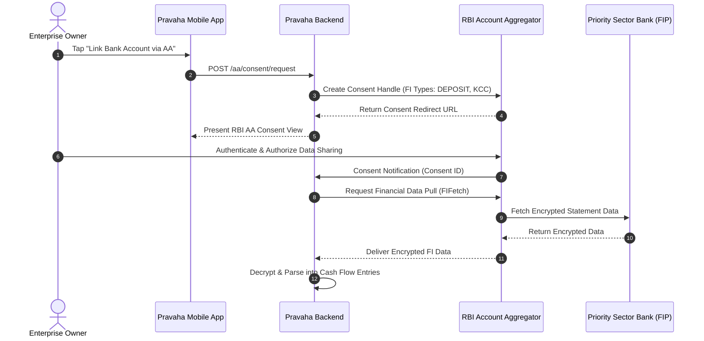

# Account Aggregator (AA) & Unified Lending Interface (ULI) Integration Design

## Overview
This document specifies the consent-based data pull architecture matching RBI's Account Aggregator (AA) framework and Unified Lending Interface (ULI) pattern for Pravaha.

## Architecture



## Data Provider Interface Contract

```python
from abc import ABC, abstractmethod

class AADataProvider(ABC):
    @abstractmethod
    async def request_consent(self, user_id: str, fi_types: list[str]) -> str:
        """Returns consent handle URL"""
        pass

    @abstractmethod
    async def fetch_financial_data(self, consent_id: str) -> list[dict]:
        """Returns normalized cash flow entries"""
        pass
```

## Implementation Roadmap
- **Phase 1 (Current)**: Mock e-Shakti provider (`ESHAKTI-*` reference IDs)
- **Phase 2 (Pilot Readiness)**: Sandbox integration with Setu / Sahamati AA gateway
- **Phase 3 (Production)**: Live ULI API integration for instant priority sector credit underwriting
